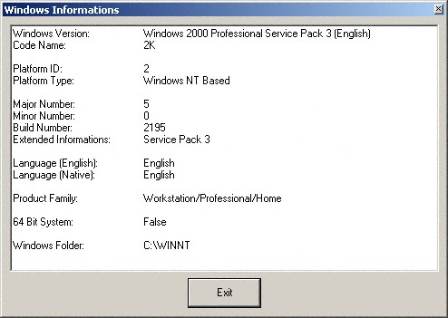



## Obtain Windows Informations \(ReWritten And Updated\)

### Description

This code can obtain the following informations about your Windows system:

1. Complete Windows version

2. Windows code name (Chicago, Whistler...)

3. Platform ID (Number)

4. Platform ID (Name)

5. Major number

6. Minor number

7. Build number

8. Service Pack number

9. Language (English and Native version)

10. Product family (Workstation, Server...)

11. 64 bit OS (Boolean)

12. Windows folder

The code is basicly commented and was 98% written by me (except the API declarations, constants and types). Therefore, please vote/leave some comments.
 
### More Info
 

             |
---                |---
**Submitted On**   |2002-10-13 18:47:00
**By**             |[Sebastian Mares](https://github.com/Planet-Source-Code/PSCIndex/blob/master/ByAuthor/sebastian-mares.md)
**Level**          |Beginner
**User Rating**    |5.0 (40 globes from 8 users)
**Compatibility**  |VB 4\.0 \(32\-bit\), VB 5\.0, VB 6\.0
**Category**       |[Windows API Call/ Explanation](https://github.com/Planet-Source-Code/PSCIndex/blob/master/ByCategory/windows-api-call-explanation__1-39.md)
**World**          |[Visual Basic](https://github.com/Planet-Source-Code/PSCIndex/blob/master/ByWorld/visual-basic.md)
**Archive File**   |[Obtain\_Win14589910142002\.zip](https://github.com/Planet-Source-Code/sebastian-mares-obtain-windows-informations-rewritten-and-updated__1-39625/archive/master.zip)

